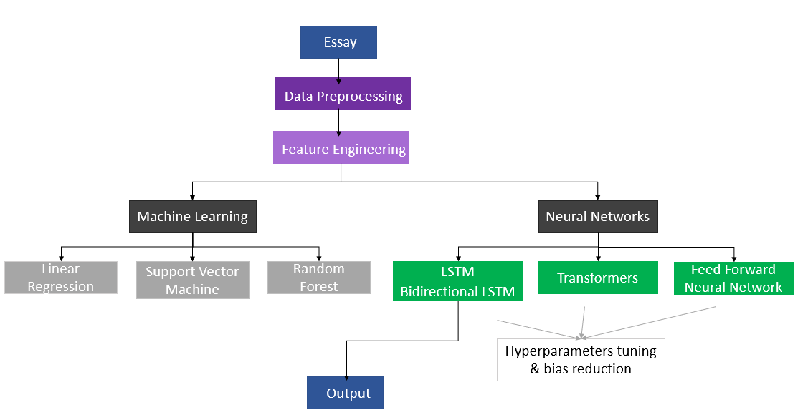

# Automated Essay Scoring with different learning algorithms

<div align="center">


<a href="https://www.tensorflow.org/resources/learn-ml/basics-of-machine-learning"></a>
<a href="https://keras.io/getting_started/"></a>
<a href="https://pandas.pydata.org/getting_started.html"></a>
 <a href="https://www.nltk.org/"></a>
<a href="https://black.readthedocs.io/en/stable/"></a>


</div>
<br><br>


<!-- TABLE OF CONTENTS -->
<details>
  <summary>Table of Contents</summary>
  <ol>
    <li>
      <a href="#getting-started">Getting started</a>
      <ul>
        <li><a href="#prerequisites">Prerequisites</a></li>
        <li><a href="#installation">Installation</a></li>
      </ul>
    </li>
    <li><a href="#about-this-project">About this project</a></li>
    <li><a href="#dataset">Dataset</a></li>
    <li><a href="#aes-objectives-diagram">AES objectives diagram</a></li>
    <li><a href="#our-models">Our models</a></li>
    <li><a href="#license">License</a></li>
    <li><a href="#contact">Contact</a></li>
  </ol>
</details>


<!-- GETTING STARTED -->
## Getting Started

This is an example of how you may give instructions on setting up this project locally.
To get a local copy up and running follow these simple example steps.

### Prerequisites

The `requirements.txt` file should list all Python libraries that your notebooks depend on, and they will be installed using:
```sh
   pip install -r requirements.txt
   ```

### Installation

_Below is an example of how you can instruct your audience on installing and setting up your app. This template doesn't rely on any external dependencies or services._

1. Clone the repo
   ```sh
   git clone https://github.com/RyanBelkhir/NLP-Essay-Scoring.git
   ```
2. Install java

3. Execute
   ```sh
   python -m spacy download en
   ```


<!-- ABOUT THE PROJECT -->
## About The Project


Automated Essay Scoring (AES) is a tool for evaluating and scoring of essays written in response to specific prompts. It can be defined as the process of scoring written essays using computer programs. The process of automating the assessment process could be useful for both educators and learners since it encourages the iterative improvements of students' writings.

Here's why AES:
* Reduce the time for assessment.
* Comparing scores obtained with ML models with human scores in order to make the scores realistic.
* Classify a corpus of textual entities into a small number of discrete categories, corresponding to possible grades.


## Dataset

The dataset we are using is ‘The Hewlett Foundation: Automated Essay Scoring Dataset’ by ASAP. You can find in the below link or download from the Dataset folder.

Link dataset : [https://www.kaggle.com/c/asap-aes/data](https://www.kaggle.com/c/asap-aes/data)

<p align="right">(<a href="#top">back to top</a>)</p>


## AES objectives diagram

<div align="center">
  <a href="https://github.com/RyanBelkhir/NLP-Essay-Scoring.git">
    
  </a>
</div>

<p align="right">(<a href="#top">back to top</a>)</p>

## Our models

**1. Data Preprocessing**

**2. Machine Learning**

**3. Deep Learning**

**4. BERT**

## License

Distributed under the MIT License. See `LICENSE.txt` for more information.

<p align="right">(<a href="#top">back to top</a>)</p>


<!-- CONTACT -->
## Contact

Salomé Papereux - [@your_twitter](https://twitter.com/your_username) - salome.papereux@dauphine.eu

Belkhir Ryan - [@your_twitter](https://twitter.com/your_username) - ryan.belkhir@dauphine.eu

Boudart Pierre - [@your_twitter](https://twitter.com/your_username) - pierre.boudart@dauphine.eu

Duval Tom - [@your_twitter](https://twitter.com/your_username) - tom.duval@dauphine.eu

Project Link: [https://github.com/RyanBelkhir/NLP-Essay-Scoring.git](https://github.com/RyanBelkhir/NLP-Essay-Scoring.git)

<p align="right">(<a href="#top">back to top</a>)</p>


<!-- MARKDOWN LINKS & IMAGES -->
<!-- https://www.markdownguide.org/basic-syntax/#reference-style-links -->
[contributors-shield]: https://img.shields.io/github/contributors/othneildrew/Best-README-Template.svg?style=for-the-badge
[contributors-url]: https://github.com/othneildrew/Best-README-Template/graphs/contributors
[forks-shield]: https://img.shields.io/github/forks/othneildrew/Best-README-Template.svg?style=for-the-badge
[forks-url]: https://github.com/othneildrew/Best-README-Template/network/members
[stars-shield]: https://img.shields.io/github/stars/othneildrew/Best-README-Template.svg?style=for-the-badge
[stars-url]: https://github.com/othneildrew/Best-README-Template/stargazers
[issues-shield]: https://img.shields.io/github/issues/othneildrew/Best-README-Template.svg?style=for-the-badge
[issues-url]: https://github.com/othneildrew/Best-README-Template/issues
[license-shield]: https://img.shields.io/github/license/othneildrew/Best-README-Template.svg?style=for-the-badge
[license-url]: https://github.com/othneildrew/Best-README-Template/blob/master/LICENSE.txt
[linkedin-shield]: https://img.shields.io/badge/-LinkedIn-black.svg?style=for-the-badge&logo=linkedin&colorB=555
[linkedin-url]: https://linkedin.com/in/othneildrew
[product-screenshot]: images/screenshot.png

